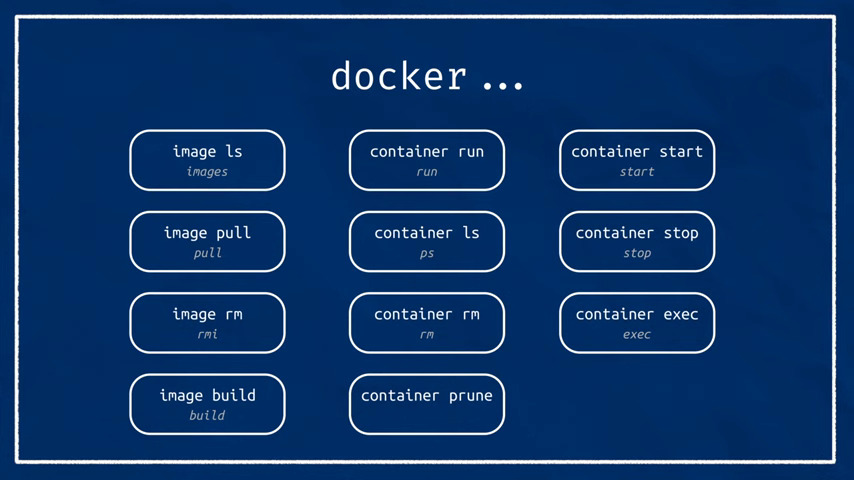

# Docker

These are some notes for using docker in general

# Build

```bash
docker build -t <image_name> .
```

you should be in the directory where the “Dockerfile” is located then you can use the dot “.” 

- to run Docker image

```bash
docker run -it --user ros
```

- run another terminal:

```bash
docker exec -it <image_tag> /bin/bash
```

- to quite the container: CTRL + D
- add graphic access:

```bash
xhost +
xhost +local
xhost +<user_name>
```

## Running examples:

```bash
docker run -it --user ros --network=host --ipc=host \
	-v /tmp/.X11-unix:/tmp/.X11-unix:rw --env=DISPLAY <image_name>
```

- for joystick input:

```bash
-v /dev/input:/dev/input -- device-cgroup-rule='c 13:* rmw'
```

- for camera:

```bash
-v /dev/bus/usb:/dev/bus/usb -- device-cgroup-rule='c 189:* rmw'
```

- to communicate with serial port like raspberry pi or arduino:

you have to add the user in the dialout group in the dockerfile.

```docker
	RUN usermod -aG dialout ${USERNAME}
```

```bash
--device=/dev/ttyACM1
or
-v /dev:/dev -- device-cgroup-rule='c 166:* rmw' 
```

- you can solve all the input devices with

```bash
-v /dev:/dev -- device-cgroup-rule='c *:* rmw' 
```

# The run command I am using:

```bash
docker run -it --user ros --network=host --ipc=host \
	-v /tmp/.X11-unix:/tmp/.X11-unix:rw --env=DISPLAY \
	-v /home/mustafa/ros2_ws:/ros2_ws \
	-v /dev:/dev --device-cgroup-rule='c *:* rmw' ros-humble
```

## Dockerfile example:

```docker
FROM osrf/ros:humble-desktop-full

# Example of installing programs
RUN apt-get update \
    && apt-get install -y \
    nano \
    vim \
    && rm -rf /var/lib/apt/lists/*

# Example of copying a file
COPY config/ /site_config/

# Create a non-root user
ARG USERNAME=ros
ARG USER_UID=1000
ARG USER_GID=$USER_UID

RUN groupadd --gid $USER_GID $USERNAME \
  && useradd -s /bin/bash --uid $USER_UID --gid $USER_GID -m $USERNAME \
  && mkdir /home/$USERNAME/.config && chown $USER_UID:$USER_GID /home/$USERNAME/.config

# Set up sudo
RUN apt-get update \
  && apt-get install -y sudo \
  && echo $USERNAME ALL=\(root\) NOPASSWD:ALL > /etc/sudoers.d/$USERNAME\
  && chmod 0440 /etc/sudoers.d/$USERNAME \
  && rm -rf /var/lib/apt/lists/*

# Copy the entrypoint and bashrc scripts so we have 
# our container's environment set up correctly
COPY entrypoint.sh /entrypoint.sh
COPY bashrc /home/${USERNAME}/.bashrc

# Set up entrypoint and default command
ENTRYPOINT ["/bin/bash", "/entrypoint.sh"]
CMD ["bash"]
```

- different args:



- if you have problems with graphics:


- if you have a problem with language or time zone:


- problem with autocomplete:

```bash
apt-get install -y \
bash-completion \
python3-argcomplete \
```

to install docker:

**[Install using the convenience script](https://docs.docker.com/engine/install/debian/#install-using-the-convenience-script), then:**

```bash
sudo groupadd docker
sudo usermod -aG docker $USER
systemctl is-enabled docker
```

then log out


**Source:** [Articulated Robotics](https://beta.articulatedrobotics.xyz/category/docker-for-robotics)